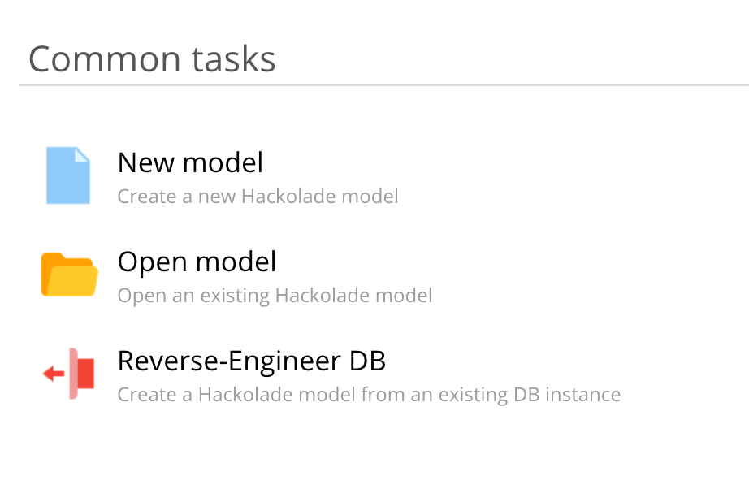

# Joi Plugin
Hackolade plugin for Joi

For each object in Hackolade, we've defined a set of standard properties that appear in the properties pane.  But it is possible that your company wants to define and track additional properties for models, containers, entities, and attributes.  Hackolade let's you do just that, by leveraging our plugin architecture (used also to integrate our modeling engine with all kinds of NoSQL document databases.)

<h1>Hackolade Joi Plugin - Generation of Joi models</h1>

  To generate joi models from your hackolade model we first need a couple of
  things:

<ol>
  <li>
    An existing model created with the JSON target of hackolade (<em
      >Note: Not required if you are building one from scratch</em
    >)
  </li>
  <li>A hackolade pro license (the only one that allows generation of Joi)</li>
  <li>
    The Joi plugin for hackolade (now available in hackolade by default, you
    just need to install it)
  </li>
</ol>

Contents

<ol>
  <li>
    <a>Installation and usage</a>
    <ol>
      <li><a>Installation</a></li>
      <li><a>Plugin features / usage</a></li>
    </ol>
  </li>
  <li><a>Generation with an existing JSON targeted model</a></li>
  <li><a>Generation through a new model created from scratch</a></li>
</ol>
<h1>Installation / usage of the Joi plugin</h1>
<h2>Installation</h2>
<h3>Step 1</h3>

To install the Joi plugin download hackolade first.

<h3>Step 2</h3>

Open hackolade and go to Help > DB target plugin manager (or "Plugin Manager" depending on hackolade version):

<h3>Step 3</h3>

Next look in the store for the Joi plugin and press on install:

  

 

Now you have successfully installed the Joi plugin.

<h3>Step 4</h3>

Restart hackolade to make the plugin show when creating a new model.

<h2>Plugin features / usage</h2>

Currently the plugin only supports the most simple features of Joi.

<h3>Joi Types Supported:</h3>

  

  If we were to create an object with each type we will see the following: (<em
    >Note: that the object type and array support multiple children because of
    their nature</em
  >)

  const schema = Joi.object().keys({ myString: Joi.string(), myInt:
  Joi.number(), myDate: Joi.date(), myBool: Joi.bool(), myObject:
  Joi.object().keys({}), myArray: Joi.array().items(Joi.string()), myNull:
  Joi.valid(null).required() });

<h3>Properties</h3>

The following properties are supported in the property pane:

  <em><strong>Joi.Required() - required (checkbox)</strong></em>

  Supported Types: String, int, date, bool, object, array, null (by default is
  always required)

  <em
    ><strong
      >
      </strong></em>

  <em><strong>Joi.Optional().allow(null) - optional (checkbox)</strong></em>

Supported Types: String, int, date, bool, object, array

  

  <strong
    ><em
      >Joi.length(), Joi.max(), Joi.min() - Min Length (Textbox), Max Length
      (Textbox), Length (Textbox)</em
    ></strong
  >

Supported Types: String

  

 

  Support for other Joi generation features will be based on feedback from
  users.

 

  <strong
    >Note: A lot of other properties are in the properties pane, please ignore
    those for now as those are default properties of hackolade.
  </strong>

  <strong>They will just be ignored by the Json plugin generation. </strong>

 

<h2>Generation with an existing JSON targeted model</h2>

  Most likely you want to generate your Joi objects from an existing JSON
  targeted model. You can do this fairly easily.

<h3>Step 1</h3>

  First open the existing model you have (the hackolade file) in VSCode or
  Notepad++ (or even notepad). Find the text &quot;appTarget&quot;. You should
  see the following:

  

Now change &quot;JSON&quot; to &quot;JOI&quot;.

  This will allow hackolade to open up your model in the Joi context (which has
  the feature to generate Joi objects)

<h3>Step 2</h3>

Next step is to open the document in hackolade

Open hackolade.

In the &quot;Common Tasks&quot; section select &quot;Open Model&quot;.

  

  Now look for the model you just changed and select it to open it in hackolade.

  If everything went correctly you should see the model loaded in hackolade.

<h3>Step 3</h3>

  The next step is generating our joi models. Go to Tools → Forward-Engineer →
  Generate Joi Objects

  

  You will notice you will be presented with a screen that allows you to select
  what you want to generate.

  

 

  Select what you want to generate Joi objects for and click on submit. Now
  select the directory and it will generate your Joi objects successfully.

  The output will put all the Joi objects in separate folders for you, if you
  have multiple documents.

  

  Lastly the Joi objects might need some adjustments as some naming you might
  have chosen for your objects in hackolade breaks the javascript syntax. 
  e.g. if you named an object "New Field" for instance, spaces aren't allowed on properties in javascript / typescript.

  

<h2>Generation through a new model created from scratch</h2>

  Generation through a new model is much easier as you will just need to create
  a need model and select the target in hackolade to be Joi.

<h3>Step 1</h3>

  Open hackolade and select &quot;New Model&quot; in &quot;Common Tasks&quot;
  section.

  

<h3>Step 2</h3>

  Next select the Joi target type (if it's not there install the plugin as
  mentioned at the start of this document.)

  

  Now create the model (if you are unfamiliar on how to create a model in
  hackolade please read the hackolade JSON documentation)

<h3>Step 3</h3>

  Next follow step 3 from the previous section &quot;Generation with an existing
  JSON targeted model&quot; and go onwards from there.

 

